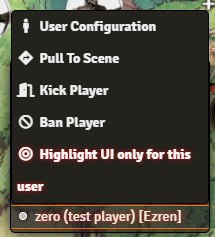
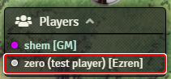
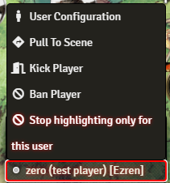
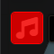
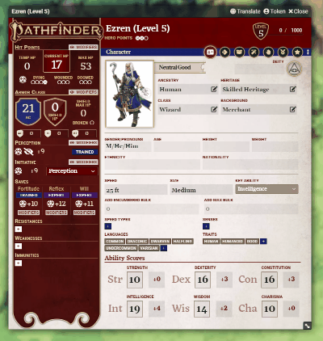
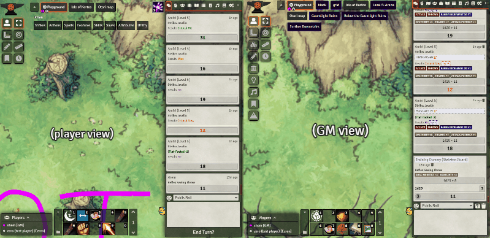

# [Remote Highlight UI](https://foundryvtt.com/packages/remote-highlight-ui/)

  

Allows users to highlight UI elements on others' screens.

To install, browse for it in the module browser, or [directly copy the manifest link for the latest release](https://github.com/shemetz/remote-highlight-ui/releases/latest/download/module.json).

Useful for teaching people the UI remotely, or bringing attention to things (e.g. the end turn button).
Serves a similar purpose to pings on the canvas, but for the UI.

To activate, Ctrl+Aux-Click on a UI element.  The element will be highlighted on all other players' screens.
"Aux-Click" is middle-click or a mouse's side button mapped to "Forward".

You can configure it in the setting to have it trigger with a Ctrl+Right-click or with Shift or Ctrl+Shift, too.

## Behavior
Once you highlight an element, it will transmit the highlight to all players who have that element in their UI.

If you're sent a highlight of something on another sidebar tab (e.g. an actor while you're looking at the chat), 
the right tab will become activated so that you can see the highlight.

If you're sent a highlight of something out of your view that can be scrolled to (e.g. a chat message from a few
minutes ago), it will scroll into view.

The highlight will normally be sent to all other users;  if you want to show it only to a particular user, you can 
right-click that user's name in the bottom left Players list and select "Highlight UI only for this player".

If you try to highlight something and it "fails" for at least one player (while you're the GM) then the existing 
highlight will turn red and stop early, to signal a failure.

## Implementation details for nerds

The module adds an `auxclick` event listener to `document.body`. When it is triggered and Ctrl is held, the code will
identify the element under the cursor, and then
the game will send a socket message to all other users with a JS selector string that uniquely identifies the
element.  Then, all users will have that element highlighted by having a few special CSS classes added to it.  It will
also scroll to put the element in view if needed (centering it vertically).

The unique selector is generated in [generate_unique_selector.js`](scripts/generate-unique-selector.js) which does 
something similar to the debugger's right-click-to-copy-selector feature but with a lot of handcrafted optimizations and
hacks to make it work best for Foundry.  The goal there is to get a short unique selector that functions as expected on
clients that have different windows open, different tools enabled, etc.  It's not perfect but it's pretty good.

The "highlight" effect is done by applying a custom `rhi-highlighted` class to the element, which draws a "box shadow"
in a huge distance around it (dimming the screen), with z-index=999 and position=relative, to help ensure it's on top.
Some of the parent elements also get custom classes temporarily added to them, to increase their z-index or to disable
their overflow=hidden so that the "box shadow" can expand beyond them.  This also includes a lot of custom hardcoded
checks because some of those hidden overflow things are important to keep (e.g. the one in the chat tab).

More custom work and maintenance will likely be needed to continually improve the applicability of this feature to all
UI elements.

In the past, this module was crazy because it added thousands of event listeners, one to nearly every single UI element.
Luckily, this is no longer the case!

## More gifs

