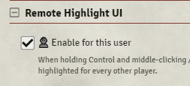

# [Remote Highlight UI](https://foundryvtt.com/packages/remote-highlight-ui/)

  

Allows users to highlight UI elements on others' screens.

To install, browse for it in the module browser, or [directly copy the manifest link for the latest release](https://github.com/itamarcu/remote-highlight-ui/releases/latest/download/module.json).

Useful for teaching people the UI remotely, or bringing attention to things (e.g. the end turn button).
Serves a similar purpose to pings on the canvas, but for the UI.

To activate, Ctrl+Aux-Click on a UI element.  The element will be highlighted on all other players' screens.
"Aux-Click" is middle-click or a mouse's side button mapped to "Forward". (left/right click won't count)

**Important:** for now this is an "opt in" feature - after enabling the module you should also enable the setting for
yourself as a user:

## Implementation details for nerds

The module adds an `auxclick` event listener to nearly every single UI element. When those are triggered and Ctrl is
held, the game will send a socket message to all other users with a JS selector string that uniquely identifies the
element.  Then, all users will have that element highlighted by having a few special CSS classes added to it.  It will
also scroll to put the element in view if needed.

The unique selector is generated in [generate_unique_selector.js`](scripts/generate-unique-selector.js) which does 
something similar to the debugger's right-click-to-copy-selector feature but with a lot of handcrafted optimizations and
hacks to make it work best for Foundry.  The goal there is to get a short unique selector that functions as expected on
clients that have different windows open, different tools enabled, etc.  It's not perfect but it's pretty good.

The "highlight" effect is done by applying a custom `rhi-highlighted` class to the element, which draws a "box shadow"
in a huge distance around it (dimming the screen), with z-index=999 and position=relative, to help ensure it's on top.
Some of the parent elements also get custom classes temporarily added to them, to increase their z-index or to disable
their overflow=hidden so that the "box shadow" can expand beyond them.  This also includes a lot of custom hardcoded
checks because some of those hidden overflow things are important to keep (e.g. the one in the chat tab).

More custom work and maintenance will likely be needed to continually improve the applicability of this feature to all
UI elements.
